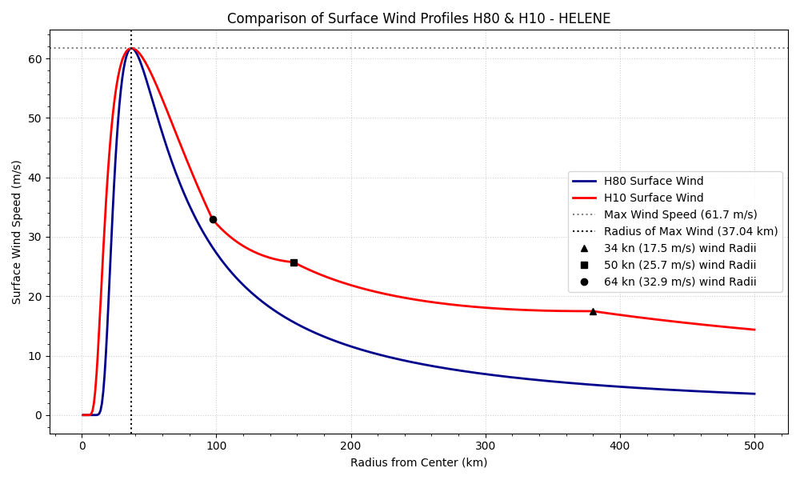
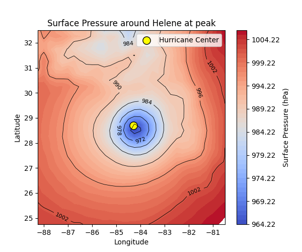
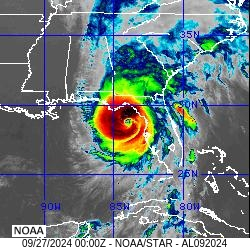

# Hurricane Wind Profile Modelling with Holland Models

This project investigates how well parametric Holland hurricane wind models can reproduce real hurricane wind profiles using observational storm data and ERA5 reanalysis pressure fields.

The work compares the original Holland (1980) model and the revised Holland (2010) model, then extends the modelling approach by introducing spatially varying pressure fields and quadrant-based asymmetric wind profiles.

This was completed as my final year project for the BSc Mathematical Sciences degree at Technological University Dublin.

---
## Project Type

This is an academic research project focused on scientific computing, numerical modelling, and analysis of real meteorological data.

The notebooks are exploratory and were developed to test modelling ideas, generate visualisations, and evaluate results. They are not intended to represent a fully automated production pipeline.

---

## Project Motivation

Hurricanes are highly destructive weather systems where wind intensity changes strongly with distance from the storm centre. Modelling this radial wind structure is important for understanding storm intensity, hazard estimation, and the limitations of simplified mathematical models.

The Holland model is useful because it describes hurricane wind fields using a small number of physically meaningful parameters, such as:

- maximum wind speed
- central pressure
- environmental pressure
- radius of maximum winds
- radial distance from the storm centre

This project focuses on North Atlantic hurricanes and tests how well these models represent real storm structures.

---

## Main Questions

The project explores three main questions:

1. How do the Holland 1980 and Holland 2010 models differ when applied to real hurricane data?
2. Can ERA5 surface pressure fields improve the modelling of environmental pressure instead of using a constant pressure value?
3. Can the Holland framework be extended to represent asymmetric hurricane wind profiles across different quadrants?

---

## Data Sources

The project uses multiple real-world meteorological datasets:

### HURDAT2 Hurricane Data

HURDAT2 data was used to extract key storm parameters, including:

- hurricane centre latitude and longitude
- maximum sustained wind speed
- minimum central pressure
- radius of maximum winds
- 34, 50, and 64 knot wind radii by quadrant

These values were used as the main observational constraints for the Holland model implementation.

### ERA5 Reanalysis Data

ERA5 surface pressure fields were used to replace the constant environmental pressure assumption with spatially varying pressure data.

This allowed the model to use pressure values that change with distance from the storm centre rather than assuming one fixed environmental pressure.

### GOES-16 Satellite Imagery

GOES-16 satellite imagery was used to visually compare the pressure fields against the physical storm structure. This helped interpret whether pressure fields were symmetric, noisy, land-influenced, or strongly asymmetric.

---

## Hurricanes Analysed

The project analysed four North Atlantic hurricanes at peak intensity:

- Hurricane Oscar
- Hurricane Helene
- Hurricane Beryl
- Hurricane Kirk

These storms were selected because they had the required observational records available for modelling, including wind radii and pressure information.

---

## Methodology

### 1. Holland 1980 Wind Profile

The Holland 1980 model was implemented as a gradient-level wind model. It uses a fixed shape parameter and produces a symmetric radial wind profile.

In this project, it was converted approximately to surface-level wind for comparison with observational data.

### 2. Holland 2010 Wind Profile

The Holland 2010 model was implemented using surface-level wind observations. Its main advantage is the variable exponent `x(r)`, which allows the wind profile to fit known wind radii at 34, 50, and 64 knots.

This makes the H10 model more flexible than H80 and better suited to real observational hurricane data.

### 3. Comparison of H80 and H10

Both models were applied to each hurricane at peak intensity. Their outputs were compared using:

- radial wind profile plots
- observed 34, 50, and 64 knot wind radii
- root mean square difference
- maximum deviation
- interval-based wind speed comparison

The results showed that H10 generally produced a broader and more realistic wind field, while H80 often decayed too quickly outside the radius of maximum winds.

### 4. ERA5 Pressure Field Integration

The standard Holland model assumes a constant environmental pressure. To test a more realistic approach, ERA5 surface pressure fields were introduced.

Instead of using a fixed pressure value, the project extracted pressure values around the hurricane centre and treated environmental pressure as a function of radius:

```text
P_n = P_n(r)
```

The model parameter b was then estimated using nonlinear least squares fitting against the ERA5-derived radial pressure profile.

### 5. Asymmetric Quadrant-Based Wind Profiles

To move beyond a single symmetric radial profile, each storm was divided into four quadrants:

- North-East
- South-East
- South-West
- North-West

Separate radial pressure profiles and wind profiles were generated for each quadrant. This allowed the model to represent directional differences in storm structure.

This was especially useful for storms where the pressure field or satellite imagery showed strong asymmetry.

---

### Key Results
#### Holland 2010 usually performed better than Holland 1980

Across most storms, H10 aligned more closely with the observed 34, 50, and 64 knot wind radii. H80 produced a smoother but more compact wind field and often underestimated wind speeds at larger radii.

#### ERA5 pressure fields helped reveal storm structure

ERA5 pressure fields showed whether each storm was approximately symmetric or affected by local pressure anomalies. For example, Helene showed a more organised pressure structure, while Kirk and Oscar showed stronger asymmetry and irregularity.

#### Asymmetric modelling was possible but sensitive to noisy data

The quadrant-based extension showed that asymmetric wind profiles can be built using the Holland framework. However, the results were highly dependent on the quality and smoothness of the pressure data.

For Beryl, most quadrants produced relatively smooth profiles, but the South-West quadrant showed a local dip connected to pressure-field asymmetry. For Kirk, the South-West quadrant had a much stronger anomaly, linked to noisy pressure variation in the first 100 km.

---

## Limitations

This project was research-focused rather than a production software system.

Current limitations include:

- Notebooks require some manual storm-specific input
- The workflow is not fully automated
- Pressure fields can be noisy or spatially inconsistent
- Quadrant averaging over large sectors may hide smaller-scale structure
- Limited wind radii observations restrict how accurately asymmetry can be modelled
- Holland models remain simplified representations of complex hurricane dynamics

The conclusion was that asymmetric Holland-based wind profiles are feasible, but reliable results require higher-quality pressure data, better azimuthal wind observations, and improved pressure-processing methods.

---

## Technologies Used
- Python
- Jupyter Notebook
- NumPy
- Pandas
- SciPy
- Matplotlib
- xarray
- ERA5 reanalysis data
- HURDAT2 hurricane data
- GOES-16 satellite imagery

## Example Outputs

The project includes several visual outputs that show the modelling process step by step.

### H80 vs H10 Wind Profile Comparisons

These plots compare the original Holland 1980 model with the revised Holland 2010 model.

They show that H80 produces a smoother but more compact wind profile, while H10 usually maintains higher wind speeds farther from the storm centre and more closely matches the observed 34, 50, and 64-knot wind radii.



### ERA5 Surface Pressure Fields

These figures show the real surface pressure field around each hurricane at peak intensity.

They were used to check whether the storm pressure structure was smooth and symmetric, or whether it contained asymmetry, land influence, or noisy pressure behaviour.



### GOES-16 Satellite Comparisons

GOES-16 satellite imagery was used as a visual check against the ERA5 pressure fields.

This helped confirm whether the pressure field matched the visible hurricane structure, especially around the eye, eyewall, and cloud distribution.



### Quadrant-Based Pressure Profiles

These plots show how pressure changes with distance from the storm centre in each quadrant:

- North-East
- South-East
- South-West
- North-West

They were important because some storms did not have the same pressure behaviour in every direction. This showed why a single symmetric pressure profile can miss important storm structure.

### Quadrant-Based Wind Profiles

These plots show the final asymmetric wind profiles produced using quadrant-specific pressure information.

They demonstrate that the Holland framework can be extended beyond one symmetric wind profile. However, they also show that noisy pressure data can create local dips or irregular wind behaviour.

